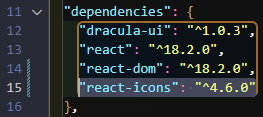

# Grocery List App

<p>
   
   
   
   
   
   
</p>

This is a _test_ app for me; I'm coding from memory with minimal checks of my notes. I notice that I didn't put the notes in one central place, so I'll be documenting the process.

## MVP

This is a relatively simple Grocery List App. It can:

- Add new items to the list either by pressing `Enter` or clicking the plus button
-

## The Process

I'm working in **VS Code** on a **Windows 11** computer, so all shortcuts I use are for those. I'm using the **ES7+ React/Redux/React-Native snippets** extension.

### Set Up the Project

To follow along, ensure you have:

- the **latest [Node version](https://nodejs.org/en/) installed**. You can check in the **terminal** with

```
node -v
```

- dido for **[Yarn](https://www.digitalocean.com/community/tutorials/how-to-install-and-use-the-yarn-package-manager-for-node-js)**

<hr>

1. Create a new React project from the command line using the Vite tool by typing:

```
yarn create vite
```

2. Enter your project name at the prompt after the quick installation.

   

3. Press `Enter` to have the package automatically named.
4. Use the arrow keys to choose a framework.

   

5. Pick JavaScript or TypeScript (_I went with JavaScript_)

   

6. Check out the cool file structure!

   

   And the message that the scaffolding is complete.

   

7. Change directories. _I got my first learning moment here as I had used two words, so I had to enclose it in commas._

   

8. Install dependencies with:

```
yarn
```

Super-fast success is proven with the `node_modules` folder being added to our file structure and this command line message:


### Spin Up the Servers

1. Start the development server on your computer with

```
yarn run dev
```

`Ctrl` + click the blue link to verify everything's working.


2. Check it out on your mobile - _Yes, you heard that right!_ Either stop the current server with `Ctrl` + `C`, or just open up a new terminal.


`cd` back to your directory, and type:

```
yarn dev run --host
```

You will get


Type the network address, then you can check out your changes on desktop and/or mobile!

### Rid Ourselves of the Boilerplate

Now it's time to get rid of the defaults!

1. It's all coming from our `/src` folder, as you can see by **l**i**s**ting all the files:

```
ls src/
```

2. Remove all the files **except `main.jsx`** with

```
rm src/App.css
```

3. Now we can actually work within our files! In `main.jsx`, remove the reference to `index.css` on _line 4_.


### Use Dracula UI


I had come across [Dracula UI](https://ui.draculatheme.com/) in my reading and really wanted to try it out! It describes itself as a:

> Dark-first collection of UI patterns and components.

First we need to install it to our project.

1. In your terminal, type `yarn add dracula-ui`.

2. I like to verify things, so you can check `package.json` to see it listed as a dependency on _line 11_.


Let's take advantage of the **in-editor docs** and **autocomplete** function in VS Code, by installing an extension to bring in **Design System Packages**.

1. `Ctrl` + `Shift` + `X` to open **Extensions** and search for **Adobe XD extension**.


2. Click on the extension icon in the **sidebar**, probably in the **bottom right corner**.


3. Click on **Load package**.


4. Choose `node_modules/dracula-ui/dsp` by navigating through all the files.


5. Choose the Code Snippets for CSS and React, click Next and you can see the docs!


### On to the Code!

1. In the `src` folder, add a new file called capital `App.jsx`.

2. Create a exported function component called `App`.

3. Add the import statements at the top.

4. **Check it's working** by adding a `main` with `h1`.


5. Bring in the **Dracula UI** components and styling! _I'm not sure if I was doing this optimally, but..._ I set up my **reset** in `index.css` with styles on the `body`. I centered my list with **CSS Grid** and set the background colour.

```css
body {
  display: grid;
  place-items: center;
  height: 100%;
  background-color: black;
}
```

6. Import the `Box` component from Dracula UI and style it up with colour, margin, padding, rounded and width properties special to the Design System.


#### Add a Component: Header

1. Add a `components` folder with `Header.jsx`.

2. Import Heading from Dracula UI on _line 2_.

3. Add the inline styles.


4. Import Header in `App.jsx`, then add component.


_The result so far..._


#### Set Default List: ItemList

1. I set up a default list of grocery items to get the list started. This goes within the `App` function and before returning the JSX.


#### Use Font Awesome Icons: AddItem

1. Create the component with imports of Dracula UI and Input component. Add `Input` tag to JSX with the style attributes.


2. Add the import line and component to `App.jsx`.


3. Use `react-icons` from [NPMJS](https://www.npmjs.com/) to import only the icons used in this project. In your terminal, type

```
yarn add react-icons --save-prod
```

Then verify it in `package.json`.


4. _Optional:_ Go to [Font Awesome](https://fontawesome.com/search) to search for `plus`. Make sure to click the _Free_ tab.

5. In `AddItem.jsx` and add `import { FaPlus } from 'react-icons/fa'` to the top of the file.

6. Because we have more than one item in the JSX, add the `<div className="inputBlock"></div>` tags to enclose `<Input>` and the button.

7. Add `FaPlus` just like a component, with attributes to add it's `role` and `tabIndex`.


8. Over in `index.css`, put `flex` on our `inputBlock` class.


#### Set up State: AddItem

1. In `App.jsx`, import `useState` on _line 6_.

2. Handle the **state** to immediately _react_ to changes our user makes in the input. Define the what's used in state, `newItem` and `setNewItem`, using the **array destructuring** from `useState`.


> I just noticed that I had `Header` as my export function in `AddItem.jsx`, so interesting that I was able to use it in `App.jsx` as `<AddItem />` - the correct name!
> 

3. Pass the props to `AddItem.jsx`, remembering to place them in **curly brackets**.


