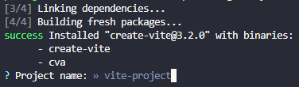

# Grocery List App

**Visit the [Live Site](https://grocery-list-jolenekearse.vercel.app/)!**

<p>
   
   
   
   
   
   
</p>

This is a _test_ app for me; I'm coding from memory with minimal checks of my notes. My aim is to gain a greater understanding of state and practice using memory. I notice that I didn't put the notes in one central place, so I'll be documenting the process.

## MVP

This is **Grocery List App** can:

- Add new items to the list either by pressing `Enter` or clicking the plus button
- Display current items with the ability to check them off and delete
- A count of remaining items in the list
- Search ability

## Table of Contents

- [The Process](https://github.com/JoleneKearse/GroceryList#the-process)
- [Add the Dependencies](https://github.com/JoleneKearse/GroceryList#add-the-dependencies)
  - [Set Up the Project](https://github.com/JoleneKearse/GroceryList#set-up-the-project)
  - [Spin Up the Servers](https://github.com/JoleneKearse/GroceryList#spin-up-the-servers)
  - [Use Dracula Ui](https://github.com/JoleneKearse/GroceryList#use-dracula-ui)
- [On to the Code!](https://github.com/JoleneKearse/GroceryList#on-to-the-code)
  - [Add a Component: `Header`](https://github.com/JoleneKearse/GroceryList#add-a-component-header)
  - [ItemList](https://github.com/JoleneKearse/GroceryList#itemlist)
    - [Set Up a Default List](https://github.com/JoleneKearse/GroceryList#set-up-a-default-list)
    - [Style with Dracula UI and CSS](https://github.com/JoleneKearse/GroceryList#style-with-dracula-ui-or-css)
    - [Use Font Awesome Icons](https://github.com/JoleneKearse/GroceryList#use-font-awesome-icons)
    - [HandleChecks](https://github.com/JoleneKearse/GroceryList#handle-checks)
  - [`AddItem` Component](https://github.com/JoleneKearse/GroceryList#additem-component)
    - [Set Up State](https://github.com/JoleneKearse/GroceryList#set-the-state)

## The Process

[top](https://github.com/JoleneKearse/GroceryList#table-of-contents)

I'm working in **VS Code** on a **Windows 11** computer, so all shortcuts I use are for those. I'm also using the **ES7+ React/Redux/React-Native snippets** extension.

## Add the Dependencies

### Set Up the Project

To follow along, ensure you have:

- the **latest [Node version](https://nodejs.org/en/) installed**. You can check in the **terminal** with

```
node -v
```

- dido for **[Yarn](https://www.digitalocean.com/community/tutorials/how-to-install-and-use-the-yarn-package-manager-for-node-js)**

<hr>

1. Create a new React project from the command line using the Vite tool by typing:

```
yarn create vite
```

2. Enter your project name at the prompt after the quick installation.

   

3. Press `Enter` to have the package automatically named.
4. Use the arrow keys to choose a framework.

   

5. Pick JavaScript or TypeScript (_I went with JavaScript_)

   

6. Check out the cool file structure!

   

   > I later moved README and screenshots folder up one level.

   And the message that the scaffolding is complete.

   

7. Change directories. _I got my first learning moment here as I had used two words, so I had to enclose it in commas._

   

8. Install dependencies with:

```
yarn
```

Super-fast success is proven with the `node_modules` folder being added to our file structure and this command line message:


### Spin Up the Servers

[top](https://github.com/JoleneKearse/GroceryList#table-of-contents)

1. Start the development server on your computer with

```
yarn run dev
```

`Ctrl` + click the blue link to verify everything's working.


2. Check it out on your mobile - _Yes, you heard that right!_ Either stop the current server with `Ctrl` + `C`, or just open up a new terminal.


`cd` back to your directory, and type:

```
yarn dev run --host
```

You will get


Type the network address (_the one with all the numbers_), then you can check out your changes on desktop and/or mobile!

### Rid Ourselves of the Boilerplate

[top](https://github.com/JoleneKearse/GroceryList#table-of-contents)

Now it's time to get rid of the defaults!

1. It's all coming from our `/src` folder, as you can see by **l**i**s**ting all the files:

```
ls src/
```

2. Remove all the files **except `main.jsx`** with

```
rm src/App.css
```

3. Now we can actually work within our files! In `main.jsx`, remove the reference to `index.css` on _line 4_.


### Use Dracula UI

[top](https://github.com/JoleneKearse/GroceryList#table-of-contents)


I had come across [Dracula UI](https://ui.draculatheme.com/) in my reading and really wanted to try it out! It describes itself as a:

> Dark-first collection of UI patterns and components.

First we need to install it to our project.

1. In your terminal, type `yarn add dracula-ui`.

2. I like to verify things, so you can check `package.json` to see it listed as a dependency on _line 11_.


Let's take advantage of the **in-editor docs** and **autocomplete** function in VS Code, by installing an extension to bring in **Design System Packages**.

1. `Ctrl` + `Shift` + `X` to open **Extensions** and search for **Adobe XD extension**.


2. Click on the extension icon in the **sidebar**, probably in the **bottom right corner**.


3. Click on **Load package**.


4. Choose `node_modules/dracula-ui/dsp` by navigating through all the files.


5. Choose the Code Snippets for CSS and React, click Next and you can see the docs!


## On to the Code!

[top](https://github.com/JoleneKearse/GroceryList#table-of-contents)

1. In the `src` folder, add a new file called (_capital!_) `App.jsx`.

2. Create a exported function component called `App`.

3. Add the import statements at the top.

4. **Check it's working** by adding a `main` with `h1`.


5. Bring in the **Dracula UI** components and styling! _I'm not sure if I was doing this optimally, but..._ I set up my **reset** in `index.css` with styles on the `body`. I centered my list with **CSS Grid** and set the background colour.

```css
body {
  display: grid;
  place-items: center;
  height: 100%;
  background-color: black;
}
```

6. Import the `Box` component from Dracula UI, add it to our App JSX and style it up with colour, margin, padding, rounded and width properties special to the Design System.


### Add a Component: `Header`

[top](https://github.com/JoleneKearse/GroceryList#table-of-contents)

1. Add a `components` folder with `Header.jsx`.

2. Import **Heading** from Dracula UI on _line 2_.

3. Add the inline styles.


4. Import Header in `App.jsx`, then add component.


_The result so far..._


### ItemList

[top](https://github.com/JoleneKearse/GroceryList#table-of-contents)

#### Set Up A Default List

[top](https://github.com/JoleneKearse/GroceryList#table-of-contents)

> I got ahead of myself here and jumped straight to **`AddItem`**, but it does make more sense to start with a static list.

1. Create an `ItemList` component. Import it in `App.jsx` and add the component in the returned JSX:

```jsx
return (
  <Box>
    <Header />
    <ItemList />
  </Box>
);
```

2. Set up a default list of grocery items to get the list started. This goes within the `ItemList` function and before returning the JSX. Include the following import statement:

```js
import { useState } from "react";
```

Set the list as a `const` with **destructuring** of `items` and `setItems` equal to `useState()` with an **array of objects**.


> Add to `ItemList.jsx`, even though it may be moved later on to `App.jsx`.

<hr>

> #### Use Font Awesome Icons
>
> [top](https://github.com/JoleneKearse/GroceryList#table-of-contents)
>
> 1. Use `react-icons` from [NPMJS](https://www.npmjs.com/) to import only the icons used in this project. In your terminal, type
>    `yarn add react-icons --save-prod`
>    Then verify it in `package.json`.

> 

> 2. _Optional:_ Go to [Font Awesome](https://fontawesome.com/search) to search for `plus`. Make sure to click the _Free_ tab.
> 3. Add the import statement to the top of the component where it will be used. Like `import { Fa< name of icon >} from "react-icons/fa";`
> 4. Add to the JSX just like a component - `<FaCheck>`.

<hr>

3. Include two more import statements for our Dracula UI components and Font Awesome icon:

```js
import { List, Checkbox } from "dracula-ui";
import { FaTrashAlt } from "react-icons/fa";
```

4. Have the `ItemList` function return a `<List>` component from **Dracula UI**.

5. Get ready to have lots of fun creating the `<li>`s! Use `.map()` on `items` created on _line 8_. This will go over each `item`, creating the JSX.

```jsx
{items.map((item) => (...))}
```

6. Create an `<li>` with a couple important attributes to enclose each line.

```jsx
<li className="item" key={item.id}>
  ...
</li>
```

7. Use the Dracula UI checkbox component passing all the properties _(pictured below)_.

8. Use the `label` as the actual item to display. _Don't worry, I'll go over all that's going on there later!_

9. Add the **Font Awesome** trash can icon on _line 55_.


#### Style with Dracula UI or CSS

[top](https://github.com/JoleneKearse/GroceryList#table-of-contents)

1. Style it! Much of this could be done through Dracula UI including: `py`, `pb`, `size` on `List` and `li`, and `color` on `Checkbox`.

2. Some were easier to control with regular CSS, like `font-size` and **hover/focus effects**. The **icons** can be targetted by the `svg` selector.

3. The most complex thing was getting the item text to change colour when the li was hovered on. I had to grab the class name using **DevTools**.

```css
li.item:hover .drac-text,
li.item:focus .drac-text {
  color: #ff80bf;
}
```

#### Handle Checks

[top](https://github.com/JoleneKearse/GroceryList#table-of-contents)

1. Set up the `handleCheck` function to take in the `id`. Create a `listItems` variable to **map over** each item: checking if it is the clicked **id**, if so create a **new array so we don't directly change the state** and then flip that item's checked value. After **set the items to the updated state**.


2. Set up **conditional styling** to add a line through the item. To the `label` tag, add a `style` attribution with curly brackets, `{ }` so we can use a **ternary operator** to only apply the rule when the item has been checked.


3. Improve UX by adding a **double click event** on the item to trigger `handleCheck` like on _line 51_ above.

4. _This is an intermediate step, to be changed later._ To have the app store the user changes, add this line to the function:

```jsx
localStorage.setItem("shoppinglist", JSON.stringify(listItems));
```

This saves the state to **local storage**.

#### Handle Delete

1. Add an `onClick` event to the **trash can icon** and use an **anonymous function** so we can pass in the **item's id**.


2. Write the function which will create an array of only the items not matching that `id`, set the state, and save to `localStorage`.


#### Add Empty List Message

1. Add `<>` and `</>` tags as the first item, then tab everything over. This is needed because we will use a ternary operator on `<List>`.

2. Next indentation over begin the ternary with `{items.length ? (`, then **cut** the `)}` - to be added afterwards. In essence, this is saying if there are items, then proceed with all the existing code.

3. Tab all the code over.

4. After the closing `</List>` tag and **one indentation in**, continue the ternary.

5. Add the Dracula UI `Text` component to the **import statement** on _line 2_.

6. Add a `<Text>` tag with a style expression and our message.

7. Paste the `)}` to close out the ternary operator.

8. One indent **in** add the closing fragment, `</>`.

9. Close the **return statement** and **function**.


> **Note**: I had quite the difficult time finding exactely which bracket (rounded, curly) was wrong. I've included a [copy of the code](https://github.com/JoleneKearse/GroceryList/blob/main/screenshots/sampleEmptyItemListMsg.jsx) up to this state to compare. I suggest using [DiffChecker](https://www.diffchecker.com/#) to compare. It's so easy to make a single, critical mistake here! 😭

### Pass **props** Down From `App` to `ItemList` Components

This tells our user how many items are on their list.

1. In `ItemList.jsx`, highlight the entire list variable, use `Ctrl` + `X` to cut it.

2. In `App.jsx`, press `Ctrl` + `C` to copy it in the **App function**, **right above the return statement**.


3. Pass `items` and `setItems` down as **props** to the `ItemList` component.


4. Repeat for `handleCheck` and `handleDelete` functions: cut and copy, and pass as props.

5. Back in `ItemList.jsx`, destructure the props to gain access. Pay attention to any that are _greyedout_, like `setItems`. A quick scan shows that it isn't used in this file (only used in the functions). So you can delete it.


6. Remove `setItems={setItems}` on _line 48_ in `App.jsx`.

7. Add `import { useState } from 'react';` to `App.jsx` and remove from `ItemList.jsx`.

### `Footer` Componenet

1. Create `Footer.jsx` using the `Paragraphy` component from Dracula UI, or `Text` will work too.


2. Import the component into `App.jsx`.


3. Add component to the JSX.

4. Pass the **prop** down to Footer. We can name it whatever we want, so we'll call it `length`.


5. Add `color` and `align` Dracula UI attributes to style.

6. Within the `Paragraph`, use the expression `{length}` to get the passed number of list items.

7. Use a ternary expression after `List` to display `Item` or `Item**s**` based on the number.


### Use Abstraction to Clean-up Code

`ItemList.jsx` is a bit unwieldy as we had a ternary expression to display our _Empty List._ message. **But** it started on _line 10_ and went all the way until _line 49_. We can make it a lot more **readable**!

1. Create a new **component** called `ListLi.jsx`.

2. Look at the **parent** to copy the props and **drill** them down.

3. **Cut and copy** the `<List>` from `ItemList` to `ListLi`.

4. Update the **import statements** for the new component.


5. Import the component into `ItemList` and add to the JSX with props.


### `AddItem` Component

[top](https://github.com/JoleneKearse/GroceryList#table-of-contents)

1. Create the component with imports of Dracula UI and Input component. Add `Input` tag to JSX with the style attributes.


2. Add the import line and component to `App.jsx`.


5. In `AddItem.jsx` and add `import { FaPlus } from 'react-icons/fa'` to the top of the file.

6. Because we have more than one item in the JSX, add the `<form className="inputBlock"></form>` tags to enclose `<Input>` and the add button we will have.

7. Add a `<label>` with `sr-only` class, so it's accessible but visually hidden.

8. Add the `Input` component, imported from Dracula UI, with `autoFocus`, `id`, `type`, `placeholder` and `required` attributes.

9. Add `FaPlus` (with import statement on _line 3_) with attributes to add it's `role`, `tabIndex` and `aria-label`.


10. Over in `index.css`, put `flex` on our `inputBlock` class.


11. Import and add the component to `App.jsx`, then set up the state with `const [newItem, setNewItem] = useState("");`.

12. Pass the props to the component: `newItem`, `setNewItem`, and the `handleSubmit` function we will create.

13. Add destructured props to `AddItem.jsx` on _line 5_: `export default function AddItem({ newItem, setNewItem, handleSubmit })`.

14. Set the `Input` tag to be the **one source of truth** for this **controlled input** with `value={newItem}`.

15. Use `onChange={(e) => setNewItem(e.target.value)}` to change the state as the user types.

16. Add `onSubmit={handleSubmit}` on the `<form>` element itself.

17. Back in the `handleSubmit` function in `App.jsx`, we first want to prevent the page reloading, then check if there is indeed an item to add, call the `addItem` function and set the state back to empty.


18. Create the `addItem` function.

19. Add the item `id` with `const id = items.length ? items[items.length - 1] + 1 : 1;`. This checks if there are items, returns the index of the item length minus 1, then increments the id, or adds an id of 1.

20. Create a new item object with `const nextNewItem = { id, checked: false, item };`.

21. Create a new array to update the state of the list, using the **spread operator** and adding the newly entered item: `const listItems = [...items, nextNewItem];`.

22. Now we use the same code to set the new state and store it, like we already have in `handleCheck` and `handleDelete`. So we can make it DRYer with a new function to call each time.


> I ran into some issues with _line 39_ with adding an `id`, so I switched to using [uuidv4](https://www.robinwieruch.de/react-add-item-to-list/). Add to dependencies with the CLI command `yarn add uuidv4`, import in `App.jsx` with `import { v4 as uuidv4 } from 'uuid';`, then call it in the `addItem` function with `const id = uuidv4()`. This is actually a more secure method!

23. Finish up the `handleSubmit` function.


24. Add `onClick={handleSubmit}` to the `<FaPlus>` tag to allow user to use both `Enter` key and button to submit.

#### Set the State

[top](https://github.com/JoleneKearse/GroceryList#table-of-contents)

1. In `App.jsx`, import `useState` on _line 6_.

2. Handle the **state** to immediately _react_ to changes our user makes in the input. Define the what's used in state, `newItem` and `setNewItem`, using the **array destructuring** from `useState`.


> I just noticed that I had `Header` as my export function in `AddItem.jsx`, so interesting that I was able to use it in `App.jsx` as `<AddItem />` - the correct name!

> 

3. Pass the props to `AddItem.jsx`, remembering to place them in **curly brackets**.


### Load State from `localStorage`

To-date the initial grocery list items are being added from our default list, so let's fix that!

1. Delete the array within `useState` on _line 12_ of `App.jsx`.

2. Replace with `JSON.parse(localStorage.getItem("shoppinglist"))`.


### Add Search Functionality

1. Add a new component `SearchItem.jsx`.

2. Have it return a `<form>` with a `className` and `onSubmit`.

3. As this form won't have a button, we will immediately prevent page reload in the `onSubmit`.

4. Add a label, like in `AddItem`.

5. Import Dracula UI and the `Input` component.

6. Add the `Input` tag with attributes, especially `role="searchbox"`.


7. Put the import statement under `AddItem` import in `App.jsx`.

8. Set the state on _line 15_: `const [search, setSearch] = useState("");`.

9. Add the component and props in the JSX.


10. Use the wonders of Dracula UI to style it with a just 6 more attributes on the `Input` tag in `SearchItem.jsx`.


11. Now link it to the state. Add the destructured props to `SearchItem`.

12. Add the reference to the props to `Input`.


13. Filter the items in `App.jsx` on _line 65_ by changing the expression: `items={items.filter(item => ((item.item).toLowerCase()).includes(search.toLowerCase()))}`.

### Add a Hook to Shift Focus

Currently, when the user uses the Plus Button to add an item, the focus stays there.


1. Import `useRef` in `AddItem.jsx` on _line 4_.

2. Add it as a variable on _line 7_.

3. Add a `ref` attribute to `Input` on _line 20_.

4. Send the focus back...

### `useEffect`

1. Add `useEffect` to import statement on _line 9_ of `App.jsx` with a comma after `useState`.

2. Set up the function with a dependency, so it only changes when something in it's dependency changes rather than when **anything** changes.

```jsx
useEffect(() => {}, []);
```

3. **Cut and copy** the `JSON.parse`... line from _line 14_'s `useState`.

4. Within `useEffect` `setItems()` to this copied line. This will set the items state **at load time**.

5. Initialize `useState` to an empty array.


